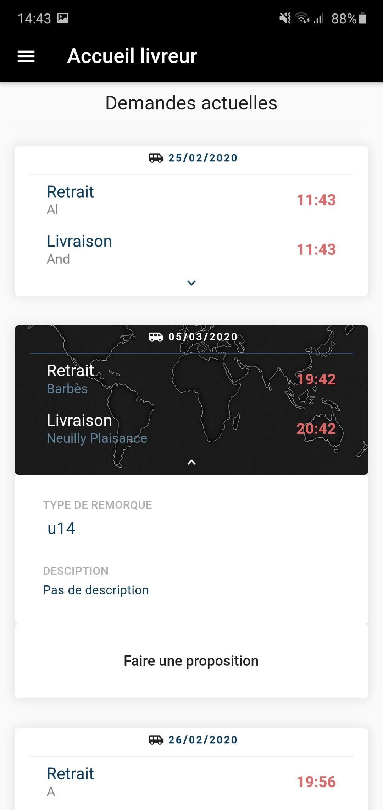
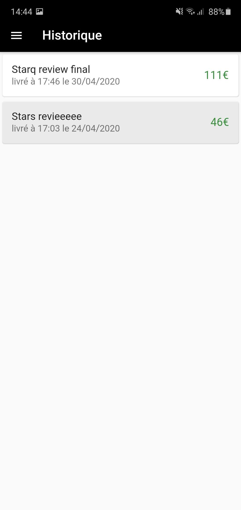
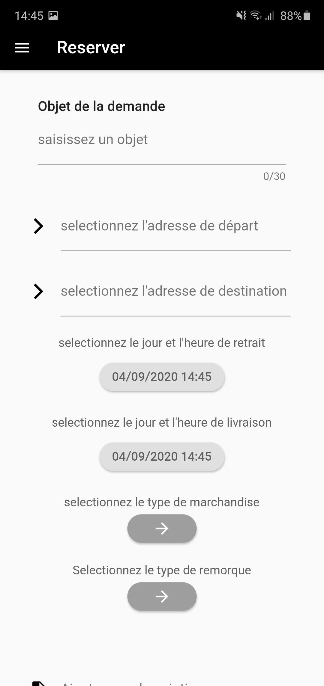
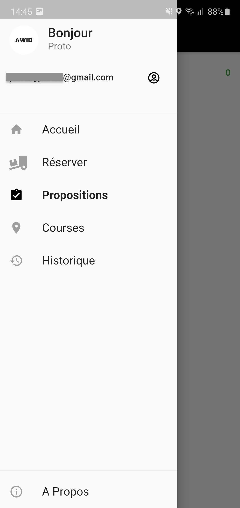
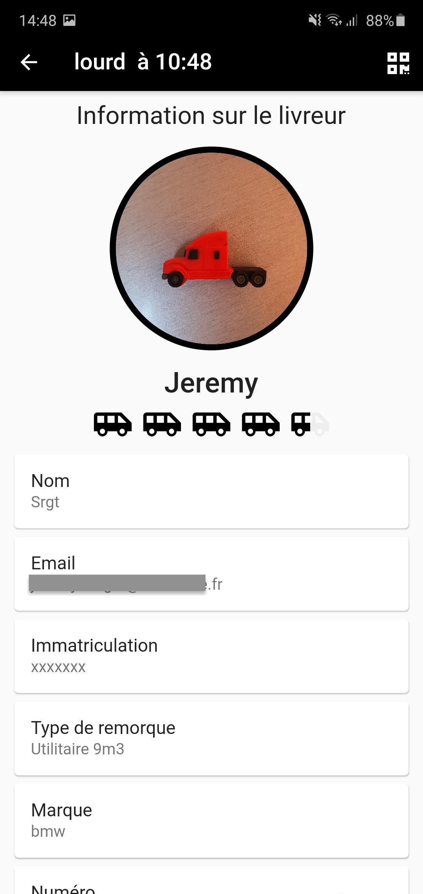

# Bring Me - Awid

Bring Me is an app that helps you find available delivery man to deliver you big packages such as furniture

### Screenshots

delivery man's home page             |  delivery information
:-------------------------:|:-------------------------:
  |  

delivery man's historic            |  Client's booking page
:-------------------------:|:-------------------------:
  |  

Client's Drawer          |  Delivery man info (client side)
:-------------------------:|:-------------------------:
  |  

## Getting Started

This project is a starting point for a Flutter application.

A few resources to get you started if this is your first Flutter project:

- [Lab: Write your first Flutter app](https://flutter.dev/docs/get-started/codelab)
- [Cookbook: Useful Flutter samples](https://flutter.dev/docs/cookbook)

For help getting started with Flutter, view our
[online documentation](https://flutter.dev/docs), which offers tutorials,
samples, guidance on mobile development, and a full API reference.

## Authors

* Developed by **JeremySrgt**
* Based on an idea from **Yanis Djebrani** and **Gregoire Day**

## Acknowledgments

* Use of Gskinner boarding pass animation template for the main page of delivery man 
https://flutter.gskinner.com/

